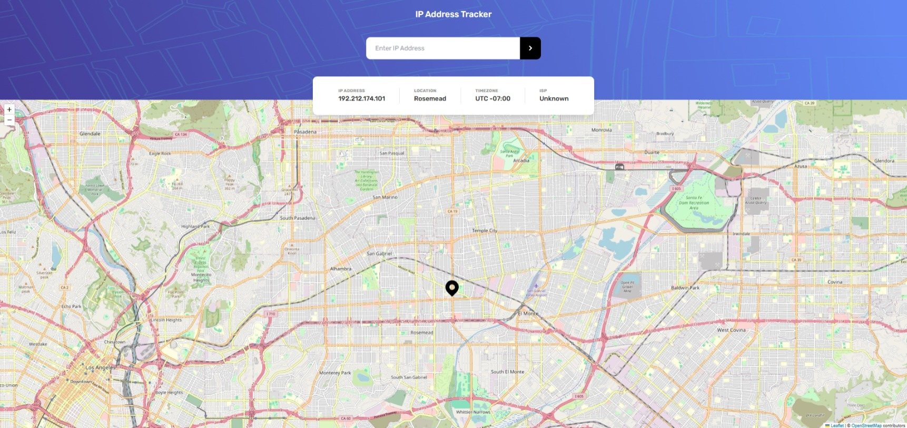

# Frontend Mentor - IP address tracker solution

This is a solution to the [IP address tracker challenge on Frontend Mentor](https://www.frontendmentor.io/challenges/ip-address-tracker-I8-0yYAH0). Frontend Mentor challenges help you improve your coding skills by building realistic projects.

## Table of contents

- [Overview](#overview)
  - [The challenge](#the-challenge)
  - [Screenshot](#screenshot)
  - [Links](#links)
- [My process](#my-process)
  - [Built with](#built-with)
  - [What I learned](#what-i-learned)
  - [Continued development](#continued-development)
  - [Useful resources](#useful-resources)
- [Author](#author)

## Overview

### The challenge

Users should be able to:

- View the optimal layout for each page depending on their device's screen size
- See hover states for all interactive elements on the page
- See their own IP address on the map on the initial page load
- Search for any IP addresses or domains and see the key information and location

### Screenshot



### Links

- Solution URL: [My solution](https://abdullarhy-tech360.github.io/ip-address-tracker-master/)
- Live Site URL: [My live site](https://abdullarhy-tech360.github.io/ip-address-tracker-master/)

## My process

### Built with

- Semantic HTML5 markup
- CSS custom properties
- Flexbox
- Mobile-first workflow
- [React](https://reactjs.org/) - JS library
- [Styled Components](https://unpkg.com/tailwindcss@^2/dist/tailwind.min.css) - For styles

### What I learned

The following are some of the things I learned while working on this project:

```css
.items-stretch {
  align-items: stretch;
}
/* Note: This is a tailwindcss class, not a CSS class */
```

```js
async function fetchLocation() {
  const response = await fetch(
    `https://geo.ipify.org/api/v2/country,city?apiKey=at_FPO3fDnjSZVDQTKx6wjHfAEGysQuj&ipAddress=${ipAddress}`
  );
  const data = await response.json();
  // // Update latLng state with fetched location
  if (data.location && data.location.lat && data.location.lng) {
    setLatLng({ lat: data.location.lat, lng: data.location.lng });
    setLocationData({
      ip: data.ip || ipAddress,
      city: data.location.city || "Unknown",
      timezone: data.location.timezone || "Unknown",
      isp: data.isp || "Unknown",
    });
  }
}
```

### Continued development

Later I will focus on learning typepescript as I haven't used it before and I discovered that it is a great tool for building large scale applications.

### Useful resources

- [Tailwind CSS](https://tailwindcss.com/) - CSS framework.
- [Leaflet](https://leafletjs.com/) - Map library.
- [React Leaflet](https://react-leaflet.js.org/) - React library for Leaflet.
- [Vite React](https://vitejs.dev/) - Frontend build tool.
- [Geo.ipify.org](https://www.geo.ipify.org/) - IP address geolocation API.

## Author

- Frontend Mentor - [@AbdullarhyTech360](https://www.frontendmentor.io/profile/AbdullarhyTech360)
- Github - [@AbdullarhyTech360](https://github.com/AbdullarhyTech360)
